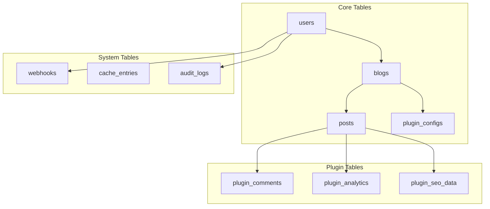
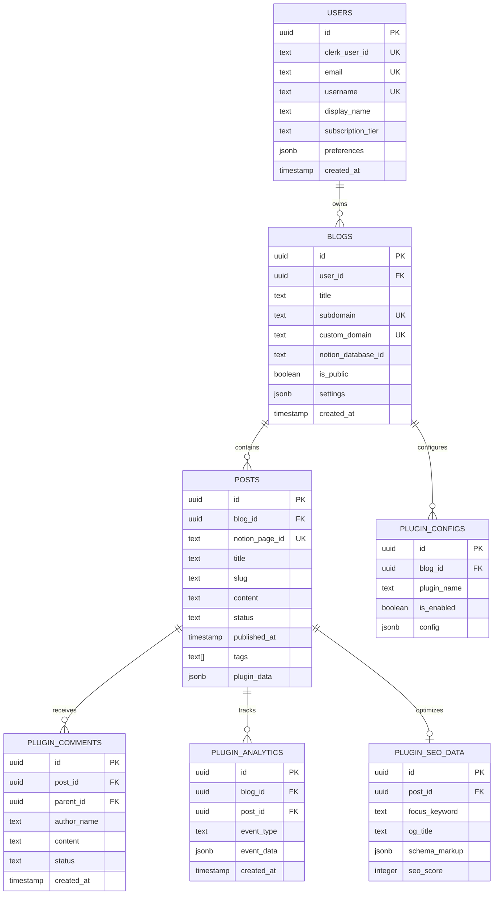

# 데이터베이스 설계 및 스키마 문서

## 📋 목차
1. [개요](#개요)
2. [데이터베이스 아키텍처](#데이터베이스-아키텍처)
3. [핵심 테이블 설계](#핵심-테이블-설계)
4. [데이터 관계도 (ERD)](#데이터-관계도-erd)
5. [인덱스 전략](#인덱스-전략)
6. [데이터 마이그레이션](#데이터-마이그레이션)
7. [성능 최적화](#성능-최적화)
8. [백업 및 복구](#백업-및-복구)

## 🗄️ 개요

### 데이터베이스 선택 이유
**Supabase (PostgreSQL 기반)**을 선택한 이유:
- **강력한 관계형 데이터베이스**: 복잡한 쿼리와 트랜잭션 지원
- **행 수준 보안 (RLS)**: 멀티 테넌트 아키텍처에 최적
- **실시간 기능**: 실시간 구독과 데이터 동기화
- **타입 안전성**: PostgreSQL의 강력한 타입 시스템
- **JSON 지원**: 유연한 스키마와 메타데이터 저장
- **확장성**: 수평적/수직적 확장 지원

### 설계 원칙

#### 1. 멀티 테넌트 설계
- **데이터 격리**: 각 사용자의 데이터 완전 분리
- **성능 격리**: 사용자별 리소스 사용량 제한
- **보안 격리**: RLS를 통한 데이터 접근 제어

#### 2. 확장성 우선
- **수평 확장**: 파티셔닝과 샤딩 지원
- **읽기 복제본**: 읽기 성능 최적화
- **캐싱 전략**: 자주 접근하는 데이터 캐싱

#### 3. 데이터 무결성
- **외래 키 제약조건**: 데이터 일관성 보장
- **체크 제약조건**: 비즈니스 룰 강제
- **트랜잭션**: ACID 속성 보장

## 🏗️ 데이터베이스 아키텍처

### 전체 스키마 구조



### 데이터베이스 연결 아키텍처

```typescript
interface DatabaseArchitecture {
  // 기본 연결 풀
  primary: {
    host: string
    maxConnections: 100
    idleTimeout: '10m'
    readWriteMode: 'read-write'
  }
  
  // 읽기 전용 복제본
  readReplicas: {
    host: string[]
    maxConnections: 50
    readOnlyMode: true
  }
  
  // 연결 풀 전략
  pooling: {
    mode: 'transaction'
    maxClientConnections: 100
    defaultPoolSize: 25
  }
}
```

## 📊 핵심 테이블 설계

### 1. 사용자 관리 (users)

```sql
-- 사용자 기본 정보
CREATE TABLE users (
  id UUID PRIMARY KEY DEFAULT gen_random_uuid(),
  
  -- Clerk 인증 정보
  clerk_user_id TEXT UNIQUE NOT NULL,
  email TEXT UNIQUE NOT NULL,
  username TEXT UNIQUE,
  
  -- 프로필 정보
  display_name TEXT,
  avatar_url TEXT,
  bio TEXT,
  
  -- 구독 정보
  subscription_tier TEXT DEFAULT 'free' CHECK (subscription_tier IN ('free', 'pro', 'enterprise')),
  subscription_expires_at TIMESTAMP WITH TIME ZONE,
  
  -- 사용량 추적
  total_blogs INTEGER DEFAULT 0,
  total_posts INTEGER DEFAULT 0,
  
  -- 메타데이터
  preferences JSONB DEFAULT '{}',
  metadata JSONB DEFAULT '{}',
  
  -- 타임스탬프
  created_at TIMESTAMP WITH TIME ZONE DEFAULT NOW(),
  updated_at TIMESTAMP WITH TIME ZONE DEFAULT NOW(),
  last_login_at TIMESTAMP WITH TIME ZONE
);

-- 인덱스
CREATE INDEX idx_users_clerk_id ON users(clerk_user_id);
CREATE INDEX idx_users_email ON users(email);
CREATE INDEX idx_users_username ON users(username) WHERE username IS NOT NULL;
CREATE INDEX idx_users_subscription ON users(subscription_tier, subscription_expires_at);

-- RLS 정책
CREATE POLICY "Users can view their own profile" ON users
  FOR SELECT USING (clerk_user_id = auth.jwt() ->> 'sub');

CREATE POLICY "Users can update their own profile" ON users
  FOR UPDATE USING (clerk_user_id = auth.jwt() ->> 'sub');
```

### 2. 블로그 관리 (blogs)

```sql
-- 블로그 설정 및 메타데이터
CREATE TABLE blogs (
  id UUID PRIMARY KEY DEFAULT gen_random_uuid(),
  
  -- 소유자 정보
  user_id UUID NOT NULL REFERENCES users(id) ON DELETE CASCADE,
  
  -- 블로그 기본 정보
  title TEXT NOT NULL,
  description TEXT,
  subdomain TEXT UNIQUE NOT NULL,
  custom_domain TEXT UNIQUE,
  
  -- Notion 통합
  notion_token_encrypted TEXT,
  notion_database_id TEXT,
  notion_sync_enabled BOOLEAN DEFAULT true,
  last_notion_sync TIMESTAMP WITH TIME ZONE,
  
  -- 설정
  theme TEXT DEFAULT 'default',
  is_public BOOLEAN DEFAULT true,
  allow_comments BOOLEAN DEFAULT true,
  
  -- SEO 설정
  meta_title TEXT,
  meta_description TEXT,
  og_image_url TEXT,
  
  -- 통계
  total_posts INTEGER DEFAULT 0,
  total_views INTEGER DEFAULT 0,
  
  -- 메타데이터
  settings JSONB DEFAULT '{}',
  metadata JSONB DEFAULT '{}',
  
  -- 타임스탬프
  created_at TIMESTAMP WITH TIME ZONE DEFAULT NOW(),
  updated_at TIMESTAMP WITH TIME ZONE DEFAULT NOW()
);

-- 인덱스
CREATE INDEX idx_blogs_user_id ON blogs(user_id);
CREATE INDEX idx_blogs_subdomain ON blogs(subdomain);
CREATE INDEX idx_blogs_custom_domain ON blogs(custom_domain) WHERE custom_domain IS NOT NULL;
CREATE INDEX idx_blogs_public ON blogs(is_public) WHERE is_public = true;

-- RLS 정책
CREATE POLICY "Users can manage their own blogs" ON blogs
  FOR ALL USING (
    EXISTS (
      SELECT 1 FROM users 
      WHERE users.id = blogs.user_id 
      AND users.clerk_user_id = auth.jwt() ->> 'sub'
    )
  );

CREATE POLICY "Public blogs are viewable by everyone" ON blogs
  FOR SELECT USING (is_public = true);
```

### 3. 게시물 관리 (posts)

```sql
-- 게시물 콘텐츠 및 메타데이터
CREATE TABLE posts (
  id UUID PRIMARY KEY DEFAULT gen_random_uuid(),
  
  -- 블로그 연관
  blog_id UUID NOT NULL REFERENCES blogs(id) ON DELETE CASCADE,
  
  -- Notion 연동
  notion_page_id TEXT UNIQUE,
  notion_last_edited TIMESTAMP WITH TIME ZONE,
  
  -- 게시물 기본 정보
  title TEXT NOT NULL,
  slug TEXT NOT NULL,
  excerpt TEXT,
  content TEXT,
  content_html TEXT,
  
  -- 상태 관리
  status TEXT DEFAULT 'draft' CHECK (status IN ('draft', 'published', 'archived')),
  published_at TIMESTAMP WITH TIME ZONE,
  
  -- SEO 데이터
  meta_title TEXT,
  meta_description TEXT,
  og_image_url TEXT,
  
  -- 분류
  tags TEXT[] DEFAULT '{}',
  categories TEXT[] DEFAULT '{}',
  
  -- 통계
  view_count INTEGER DEFAULT 0,
  like_count INTEGER DEFAULT 0,
  comment_count INTEGER DEFAULT 0,
  
  -- 콘텐츠 메타데이터
  word_count INTEGER,
  reading_time_minutes INTEGER,
  
  -- 플러그인 데이터
  plugin_data JSONB DEFAULT '{}',
  
  -- 타임스탬프
  created_at TIMESTAMP WITH TIME ZONE DEFAULT NOW(),
  updated_at TIMESTAMP WITH TIME ZONE DEFAULT NOW()
);

-- 고유 제약조건
ALTER TABLE posts ADD CONSTRAINT posts_blog_slug_unique UNIQUE (blog_id, slug);

-- 인덱스
CREATE INDEX idx_posts_blog_id ON posts(blog_id);
CREATE INDEX idx_posts_status_published ON posts(status, published_at DESC) WHERE status = 'published';
CREATE INDEX idx_posts_notion_page_id ON posts(notion_page_id) WHERE notion_page_id IS NOT NULL;
CREATE INDEX idx_posts_tags ON posts USING gin(tags);
CREATE INDEX idx_posts_categories ON posts USING gin(categories);
CREATE INDEX idx_posts_plugin_data ON posts USING gin(plugin_data);

-- 전문 검색 인덱스
CREATE INDEX idx_posts_search ON posts USING gin(
  to_tsvector('english', title || ' ' || coalesce(excerpt, '') || ' ' || coalesce(content, ''))
) WHERE status = 'published';

-- RLS 정책
CREATE POLICY "Blog owners can manage their posts" ON posts
  FOR ALL USING (
    EXISTS (
      SELECT 1 FROM blogs 
      JOIN users ON blogs.user_id = users.id
      WHERE blogs.id = posts.blog_id 
      AND users.clerk_user_id = auth.jwt() ->> 'sub'
    )
  );

CREATE POLICY "Published posts are viewable on public blogs" ON posts
  FOR SELECT USING (
    status = 'published' AND EXISTS (
      SELECT 1 FROM blogs 
      WHERE blogs.id = posts.blog_id 
      AND blogs.is_public = true
    )
  );
```

### 4. 플러그인 설정 (plugin_configs)

```sql
-- 플러그인별 설정 저장
CREATE TABLE plugin_configs (
  id UUID PRIMARY KEY DEFAULT gen_random_uuid(),
  
  -- 연관 정보
  blog_id UUID NOT NULL REFERENCES blogs(id) ON DELETE CASCADE,
  plugin_name TEXT NOT NULL,
  plugin_version TEXT NOT NULL,
  
  -- 플러그인 상태
  is_enabled BOOLEAN DEFAULT true,
  
  -- 설정 데이터
  config JSONB NOT NULL DEFAULT '{}',
  
  -- 메타데이터
  installation_date TIMESTAMP WITH TIME ZONE DEFAULT NOW(),
  last_updated TIMESTAMP WITH TIME ZONE DEFAULT NOW()
);

-- 고유 제약조건
ALTER TABLE plugin_configs ADD CONSTRAINT plugin_configs_blog_plugin_unique 
  UNIQUE (blog_id, plugin_name);

-- 인덱스
CREATE INDEX idx_plugin_configs_blog_id ON plugin_configs(blog_id);
CREATE INDEX idx_plugin_configs_plugin_name ON plugin_configs(plugin_name);
CREATE INDEX idx_plugin_configs_enabled ON plugin_configs(is_enabled) WHERE is_enabled = true;

-- RLS 정책
CREATE POLICY "Blog owners can manage plugin configs" ON plugin_configs
  FOR ALL USING (
    EXISTS (
      SELECT 1 FROM blogs 
      JOIN users ON blogs.user_id = users.id
      WHERE blogs.id = plugin_configs.blog_id 
      AND users.clerk_user_id = auth.jwt() ->> 'sub'
    )
  );
```

## 🔌 플러그인 테이블

### 1. 댓글 플러그인 (plugin_comments)

```sql
-- 댓글 시스템
CREATE TABLE plugin_comments (
  id UUID PRIMARY KEY DEFAULT gen_random_uuid(),
  
  -- 게시물 연관
  post_id UUID NOT NULL REFERENCES posts(id) ON DELETE CASCADE,
  blog_id UUID NOT NULL REFERENCES blogs(id) ON DELETE CASCADE,
  
  -- 댓글 계층 구조
  parent_id UUID REFERENCES plugin_comments(id) ON DELETE CASCADE,
  
  -- 작성자 정보
  author_name TEXT NOT NULL,
  author_email TEXT NOT NULL,
  author_website TEXT,
  author_avatar_url TEXT,
  
  -- 댓글 내용
  content TEXT NOT NULL,
  content_html TEXT,
  
  -- 상태 관리
  status TEXT DEFAULT 'pending' CHECK (status IN ('pending', 'approved', 'spam', 'deleted')),
  is_pinned BOOLEAN DEFAULT false,
  
  -- IP 및 추적 정보
  ip_address INET,
  user_agent TEXT,
  
  -- 통계
  like_count INTEGER DEFAULT 0,
  reply_count INTEGER DEFAULT 0,
  
  -- 타임스탬프
  created_at TIMESTAMP WITH TIME ZONE DEFAULT NOW(),
  updated_at TIMESTAMP WITH TIME ZONE DEFAULT NOW()
);

-- 인덱스
CREATE INDEX idx_comments_post_id ON plugin_comments(post_id);
CREATE INDEX idx_comments_parent_id ON plugin_comments(parent_id) WHERE parent_id IS NOT NULL;
CREATE INDEX idx_comments_status ON plugin_comments(status);
CREATE INDEX idx_comments_created_at ON plugin_comments(created_at DESC);

-- RLS 정책
CREATE POLICY "Comments are viewable on public posts" ON plugin_comments
  FOR SELECT USING (
    status = 'approved' AND EXISTS (
      SELECT 1 FROM posts 
      JOIN blogs ON posts.blog_id = blogs.id
      WHERE posts.id = plugin_comments.post_id 
      AND posts.status = 'published'
      AND blogs.is_public = true
    )
  );

CREATE POLICY "Blog owners can manage comments" ON plugin_comments
  FOR ALL USING (
    EXISTS (
      SELECT 1 FROM blogs 
      JOIN users ON blogs.user_id = users.id
      WHERE blogs.id = plugin_comments.blog_id 
      AND users.clerk_user_id = auth.jwt() ->> 'sub'
    )
  );
```

### 2. 분석 플러그인 (plugin_analytics)

```sql
-- 페이지 뷰 및 분석 데이터
CREATE TABLE plugin_analytics (
  id UUID PRIMARY KEY DEFAULT gen_random_uuid(),
  
  -- 연관 정보
  blog_id UUID NOT NULL REFERENCES blogs(id) ON DELETE CASCADE,
  post_id UUID REFERENCES posts(id) ON DELETE CASCADE,
  
  -- 이벤트 정보
  event_type TEXT NOT NULL CHECK (event_type IN ('page_view', 'post_view', 'search', 'click', 'download')),
  event_data JSONB DEFAULT '{}',
  
  -- 사용자 세션 정보
  session_id TEXT,
  visitor_id TEXT,
  
  -- 요청 정보
  ip_address INET,
  user_agent TEXT,
  referer TEXT,
  
  -- 지리적 정보
  country_code TEXT,
  city TEXT,
  
  -- 기기 정보
  device_type TEXT CHECK (device_type IN ('desktop', 'tablet', 'mobile')),
  browser TEXT,
  os TEXT,
  
  -- 타임스탬프
  created_at TIMESTAMP WITH TIME ZONE DEFAULT NOW()
);

-- 파티셔닝 (월별)
CREATE TABLE plugin_analytics_y2024m01 PARTITION OF plugin_analytics
  FOR VALUES FROM ('2024-01-01') TO ('2024-02-01');

-- 인덱스
CREATE INDEX idx_analytics_blog_id_date ON plugin_analytics(blog_id, created_at DESC);
CREATE INDEX idx_analytics_post_id_date ON plugin_analytics(post_id, created_at DESC) WHERE post_id IS NOT NULL;
CREATE INDEX idx_analytics_event_type ON plugin_analytics(event_type);
CREATE INDEX idx_analytics_session_id ON plugin_analytics(session_id) WHERE session_id IS NOT NULL;

-- RLS 정책
CREATE POLICY "Blog owners can view their analytics" ON plugin_analytics
  FOR SELECT USING (
    EXISTS (
      SELECT 1 FROM blogs 
      JOIN users ON blogs.user_id = users.id
      WHERE blogs.id = plugin_analytics.blog_id 
      AND users.clerk_user_id = auth.jwt() ->> 'sub'
    )
  );
```

### 3. SEO 플러그인 (plugin_seo_data)

```sql
-- SEO 최적화 데이터
CREATE TABLE plugin_seo_data (
  id UUID PRIMARY KEY DEFAULT gen_random_uuid(),
  
  -- 연관 정보
  post_id UUID NOT NULL REFERENCES posts(id) ON DELETE CASCADE,
  blog_id UUID NOT NULL REFERENCES blogs(id) ON DELETE CASCADE,
  
  -- SEO 메타데이터
  focus_keyword TEXT,
  meta_robots TEXT DEFAULT 'index,follow',
  canonical_url TEXT,
  
  -- Open Graph 데이터
  og_title TEXT,
  og_description TEXT,
  og_image_url TEXT,
  og_type TEXT DEFAULT 'article',
  
  -- Twitter Card 데이터
  twitter_card TEXT DEFAULT 'summary_large_image',
  twitter_title TEXT,
  twitter_description TEXT,
  twitter_image_url TEXT,
  
  -- 구조화된 데이터
  schema_markup JSONB DEFAULT '{}',
  
  -- SEO 분석
  seo_score INTEGER,
  seo_analysis JSONB DEFAULT '{}',
  
  -- 타임스탬프
  created_at TIMESTAMP WITH TIME ZONE DEFAULT NOW(),
  updated_at TIMESTAMP WITH TIME ZONE DEFAULT NOW()
);

-- 고유 제약조건
ALTER TABLE plugin_seo_data ADD CONSTRAINT seo_data_post_unique UNIQUE (post_id);

-- 인덱스
CREATE INDEX idx_seo_data_blog_id ON plugin_seo_data(blog_id);
CREATE INDEX idx_seo_data_focus_keyword ON plugin_seo_data(focus_keyword) WHERE focus_keyword IS NOT NULL;

-- RLS 정책
CREATE POLICY "Blog owners can manage SEO data" ON plugin_seo_data
  FOR ALL USING (
    EXISTS (
      SELECT 1 FROM blogs 
      JOIN users ON blogs.user_id = users.id
      WHERE blogs.id = plugin_seo_data.blog_id 
      AND users.clerk_user_id = auth.jwt() ->> 'sub'
    )
  );
```

## 🔗 데이터 관계도 (ERD)

### 핵심 엔티티 관계



## 📈 인덱스 전략

### 성능 최적화를 위한 인덱스

#### 1. 복합 인덱스

```sql
-- 블로그별 공개된 게시물 조회 최적화
CREATE INDEX idx_posts_blog_published ON posts(blog_id, status, published_at DESC) 
WHERE status = 'published';

-- 태그별 게시물 검색 최적화
CREATE INDEX idx_posts_tags_published ON posts USING gin(tags) 
WHERE status = 'published';

-- 사용자별 블로그 관리 최적화
CREATE INDEX idx_blogs_user_created ON blogs(user_id, created_at DESC);

-- 댓글 계층 구조 조회 최적화
CREATE INDEX idx_comments_post_parent ON plugin_comments(post_id, parent_id, created_at);
```

#### 2. 조건부 인덱스

```sql
-- 공개 블로그만 인덱싱
CREATE INDEX idx_blogs_public_subdomain ON blogs(subdomain) 
WHERE is_public = true;

-- 승인된 댓글만 인덱싱
CREATE INDEX idx_comments_approved ON plugin_comments(post_id, created_at DESC) 
WHERE status = 'approved';

-- 활성화된 플러그인만 인덱싱
CREATE INDEX idx_plugin_configs_active ON plugin_configs(blog_id, plugin_name) 
WHERE is_enabled = true;
```

#### 3. 전문 검색 인덱스

```sql
-- 게시물 전문 검색
CREATE INDEX idx_posts_fulltext ON posts USING gin(
  to_tsvector('english', 
    coalesce(title, '') || ' ' || 
    coalesce(excerpt, '') || ' ' || 
    coalesce(content, '')
  )
) WHERE status = 'published';

-- 다국어 검색 지원
CREATE INDEX idx_posts_fulltext_korean ON posts USING gin(
  to_tsvector('korean', 
    coalesce(title, '') || ' ' || 
    coalesce(content, '')
  )
) WHERE status = 'published';
```

### 인덱스 모니터링

```sql
-- 인덱스 사용률 확인
SELECT 
  schemaname,
  tablename,
  indexname,
  idx_scan,
  idx_tup_read,
  idx_tup_fetch
FROM pg_stat_user_indexes
ORDER BY idx_scan DESC;

-- 미사용 인덱스 확인
SELECT 
  schemaname,
  tablename,
  indexname,
  idx_scan
FROM pg_stat_user_indexes
WHERE idx_scan = 0;
```

## 🔄 데이터 마이그레이션

### 마이그레이션 전략

#### 1. 버전 관리

```sql
-- 마이그레이션 버전 테이블
CREATE TABLE schema_migrations (
  version TEXT PRIMARY KEY,
  name TEXT NOT NULL,
  executed_at TIMESTAMP WITH TIME ZONE DEFAULT NOW(),
  checksum TEXT NOT NULL
);
```

#### 2. 스키마 변경 스크립트

```sql
-- 20241201_add_custom_domain_to_blogs.sql
BEGIN;

-- 커스텀 도메인 컬럼 추가
ALTER TABLE blogs ADD COLUMN custom_domain TEXT;

-- 고유 제약조건 추가
ALTER TABLE blogs ADD CONSTRAINT blogs_custom_domain_unique 
  UNIQUE (custom_domain);

-- 인덱스 추가
CREATE INDEX idx_blogs_custom_domain ON blogs(custom_domain) 
WHERE custom_domain IS NOT NULL;

-- 마이그레이션 기록
INSERT INTO schema_migrations (version, name, checksum) 
VALUES ('20241201_001', 'add_custom_domain_to_blogs', 'sha256_hash');

COMMIT;
```

#### 3. 데이터 마이그레이션

```sql
-- 기존 데이터 변환 예시
UPDATE posts 
SET plugin_data = jsonb_set(
  plugin_data, 
  '{seo}', 
  jsonb_build_object(
    'title', meta_title,
    'description', meta_description
  )
)
WHERE meta_title IS NOT NULL OR meta_description IS NOT NULL;
```

### 롤백 전략

```sql
-- 롤백 스크립트 예시
BEGIN;

-- 변경사항 되돌리기
DROP INDEX IF EXISTS idx_blogs_custom_domain;
ALTER TABLE blogs DROP CONSTRAINT IF EXISTS blogs_custom_domain_unique;
ALTER TABLE blogs DROP COLUMN IF EXISTS custom_domain;

-- 마이그레이션 기록 삭제
DELETE FROM schema_migrations WHERE version = '20241201_001';

COMMIT;
```

## ⚡ 성능 최적화

### 쿼리 최적화

#### 1. 효율적인 데이터 조회

```sql
-- 블로그별 최근 게시물 (LIMIT 적용)
SELECT p.id, p.title, p.slug, p.published_at
FROM posts p
WHERE p.blog_id = $1 
  AND p.status = 'published'
ORDER BY p.published_at DESC
LIMIT 10;

-- 게시물 상세 조회 (필요한 컬럼만)
SELECT 
  p.id, p.title, p.content, p.published_at,
  b.title as blog_title, b.subdomain
FROM posts p
JOIN blogs b ON p.blog_id = b.id
WHERE p.slug = $1 AND b.subdomain = $2
  AND p.status = 'published';
```

#### 2. 집계 쿼리 최적화

```sql
-- 블로그 통계 (서브쿼리 활용)
SELECT 
  b.id,
  b.title,
  (SELECT COUNT(*) FROM posts WHERE blog_id = b.id AND status = 'published') as post_count,
  (SELECT COALESCE(SUM(view_count), 0) FROM posts WHERE blog_id = b.id) as total_views
FROM blogs b
WHERE b.user_id = $1;
```

### 캐싱 전략

#### 1. 애플리케이션 레벨 캐싱

```typescript
interface CacheStrategy {
  // 게시물 목록 캐싱 (5분)
  postsList: {
    key: `blog:${blogId}:posts`
    ttl: 300
  }
  
  // 게시물 상세 캐싱 (1시간)
  postDetail: {
    key: `post:${postId}`
    ttl: 3600
  }
  
  // 블로그 설정 캐싱 (1일)
  blogConfig: {
    key: `blog:${blogId}:config`
    ttl: 86400
  }
}
```

#### 2. 데이터베이스 레벨 캐싱

```sql
-- 자주 조회되는 데이터를 위한 구체화된 뷰
CREATE MATERIALIZED VIEW blog_stats AS
SELECT 
  b.id,
  b.title,
  COUNT(p.id) as post_count,
  COALESCE(SUM(p.view_count), 0) as total_views,
  MAX(p.published_at) as last_post_date
FROM blogs b
LEFT JOIN posts p ON b.id = p.blog_id AND p.status = 'published'
GROUP BY b.id, b.title;

-- 인덱스 추가
CREATE UNIQUE INDEX idx_blog_stats_id ON blog_stats(id);

-- 주기적 갱신 (cron job)
REFRESH MATERIALIZED VIEW CONCURRENTLY blog_stats;
```

### 파티셔닝 전략

```sql
-- 분석 데이터 월별 파티셔닝
CREATE TABLE plugin_analytics (
  id UUID NOT NULL,
  blog_id UUID NOT NULL,
  event_type TEXT NOT NULL,
  created_at TIMESTAMP WITH TIME ZONE NOT NULL DEFAULT NOW(),
  -- 기타 컬럼들...
) PARTITION BY RANGE (created_at);

-- 월별 파티션 생성
CREATE TABLE plugin_analytics_y2024m01 PARTITION OF plugin_analytics
  FOR VALUES FROM ('2024-01-01') TO ('2024-02-01');

CREATE TABLE plugin_analytics_y2024m02 PARTITION OF plugin_analytics
  FOR VALUES FROM ('2024-02-01') TO ('2024-03-01');
```

## 💾 백업 및 복구

### 백업 전략

#### 1. 정기 백업

```bash
#!/bin/bash
# 일일 백업 스크립트

DB_NAME="noxion_prod"
BACKUP_DIR="/backups/daily"
DATE=$(date +%Y%m%d_%H%M%S)

# 전체 백업
pg_dump -h $DB_HOST -U $DB_USER -d $DB_NAME \
  --format=custom \
  --compress=9 \
  --file="$BACKUP_DIR/noxion_$DATE.dump"

# 압축 및 암호화
gpg --encrypt --recipient backup@noxion.com \
  "$BACKUP_DIR/noxion_$DATE.dump"

# 7일 이전 백업 삭제
find $BACKUP_DIR -name "*.dump*" -mtime +7 -delete
```

#### 2. 증분 백업

```sql
-- WAL 아카이빙 설정
ALTER SYSTEM SET wal_level = replica;
ALTER SYSTEM SET archive_mode = on;
ALTER SYSTEM SET archive_command = 'cp %p /backup/wal/%f';
```

### 복구 시나리오

#### 1. 단일 테이블 복구

```bash
# 특정 테이블만 복구
pg_restore -h $DB_HOST -U $DB_USER -d $DB_NAME \
  --table=posts \
  noxion_backup.dump
```

#### 2. 시점 복구 (PITR)

```bash
# 특정 시점으로 복구
pg_basebackup -h $DB_HOST -U $DB_USER \
  -D /var/lib/postgresql/recovery \
  --checkpoint=fast

# recovery.conf 설정
echo "restore_command = 'cp /backup/wal/%f %p'" > recovery.conf
echo "recovery_target_time = '2024-01-15 14:30:00'" >> recovery.conf
```

### 재해 복구 계획

```yaml
disaster_recovery:
  rto: 4h  # Recovery Time Objective
  rpo: 1h  # Recovery Point Objective
  
  backup_locations:
    - primary: AWS S3 (same region)
    - secondary: AWS S3 (different region)
    - tertiary: Google Cloud Storage
  
  monitoring:
    - backup_success_alerts
    - backup_size_monitoring
    - restore_time_testing
```

---

*이 데이터베이스 설계 문서는 Noxion 프로젝트의 데이터 구조와 관리 전략을 상세히 정의합니다. 시스템 발전에 따라 지속적으로 업데이트됩니다.*