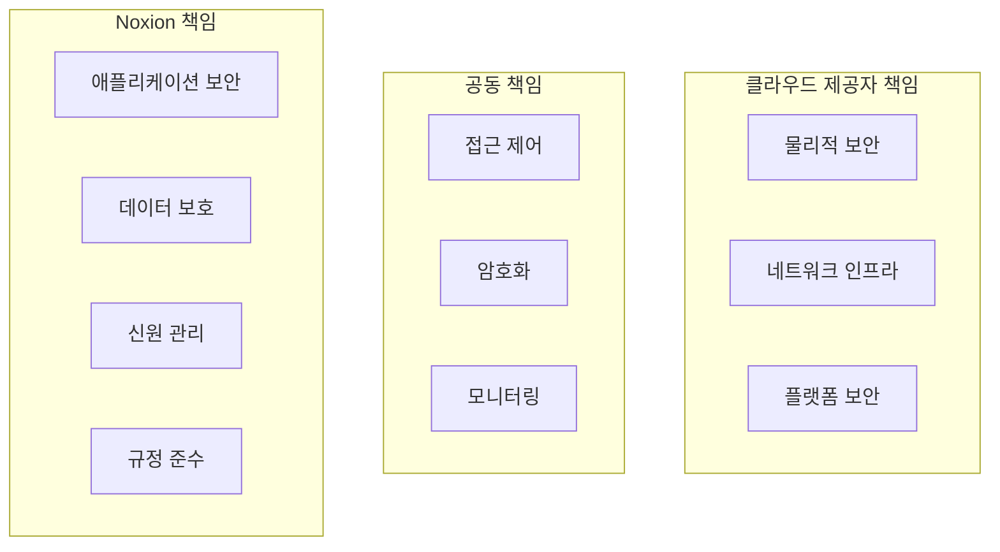
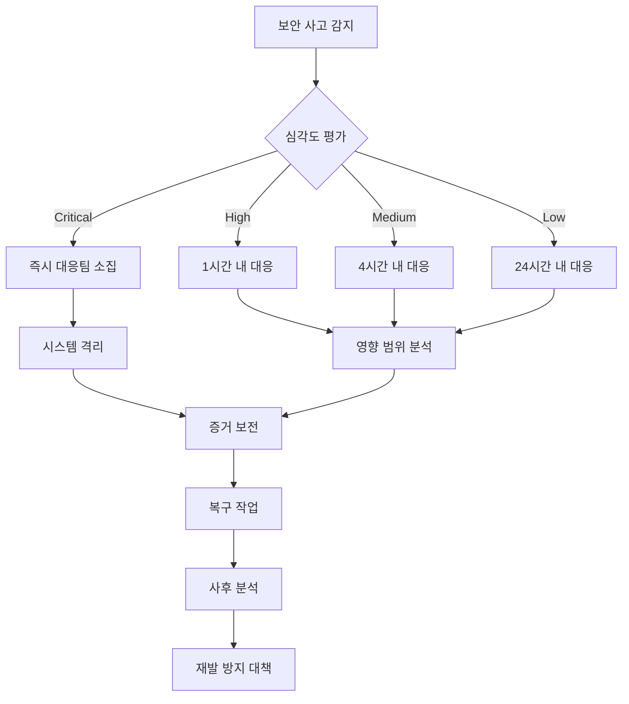

# 보안 및 규정 준수 문서

## 📋 목차
1. [보안 개요](#보안-개요)
2. [보안 아키텍처](#보안-아키텍처)
3. [인증 및 권한 부여](#인증-및-권한-부여)
4. [데이터 보호](#데이터-보호)
5. [규정 준수](#규정-준수)
6. [보안 모니터링](#보안-모니터링)
7. [취약점 관리](#취약점-관리)
8. [사고 대응](#사고-대응)

## 🛡️ 보안 개요

### 보안 원칙

#### 1. 심층 방어 (Defense in Depth)
- **다층 보안**: 네트워크, 애플리케이션, 데이터 계층별 보안 적용
- **제로 트러스트**: 모든 요청을 검증하고 권한 확인
- **최소 권한 원칙**: 필요한 최소 권한만 부여
- **실패 시 안전**: 오류 시 보안이 강화되는 방향으로 설계

#### 2. 개인정보 보호 중심 설계
- **데이터 최소화**: 필요한 정보만 수집
- **목적 제한**: 수집 목적 외 사용 금지
- **투명성**: 데이터 처리에 대한 명확한 고지
- **사용자 제어**: 개인정보 관리 권한 제공

### 보안 책임 모델



## 🏗️ 보안 아키텍처

### 네트워크 보안

#### 1. 외부 경계 보안
```typescript
interface NetworkSecurity {
  cdn: {
    provider: 'Cloudflare'
    features: [
      'DDoS Protection',
      'Web Application Firewall',
      'SSL/TLS Termination',
      'Bot Management'
    ]
  }
  
  dns: {
    provider: 'Cloudflare'
    security: [
      'DNSSEC',
      'DNS over HTTPS',
      'DNS Filtering'
    ]
  }
  
  rateLimit: {
    general: '1000 requests/hour'
    api: '100 requests/minute' 
    auth: '10 attempts/minute'
  }
}
```

#### 2. 내부 네트워크 보안
```yaml
internal_security:
  database_access:
    - "VPC 내부 통신만 허용"
    - "암호화된 연결 강제"
    - "행 수준 보안 (RLS) 적용"
  
  service_communication:
    - "HTTPS 통신 강제"
    - "API 키 기반 인증"
    - "요청 서명 검증"
  
  logging:
    - "모든 네트워크 요청 로깅"
    - "의심스러운 트래픽 탐지"
    - "실시간 알림 시스템"
```

### 애플리케이션 보안

#### 1. 보안 헤더
```typescript
// middleware.ts
export function middleware(request: NextRequest) {
  const response = NextResponse.next()
  
  // 보안 헤더 설정
  response.headers.set('X-Frame-Options', 'DENY')
  response.headers.set('X-Content-Type-Options', 'nosniff')
  response.headers.set('X-XSS-Protection', '1; mode=block')
  response.headers.set('Referrer-Policy', 'strict-origin-when-cross-origin')
  response.headers.set('Permissions-Policy', 'camera=(), microphone=(), geolocation=()')
  
  // CSP 설정
  response.headers.set('Content-Security-Policy', `
    default-src 'self';
    script-src 'self' 'unsafe-inline' 'unsafe-eval' *.vercel-scripts.com;
    style-src 'self' 'unsafe-inline' fonts.googleapis.com;
    font-src 'self' fonts.gstatic.com;
    img-src 'self' data: https: *.supabase.co *.notion.so;
    connect-src 'self' *.supabase.co *.clerk.accounts.dev;
    frame-src 'none';
  `.replace(/\s+/g, ' ').trim())
  
  return response
}
```

#### 2. 입력 검증 및 정제
```typescript
// lib/validation.ts
import { z } from 'zod'
import DOMPurify from 'isomorphic-dompurify'

// 입력 스키마 정의
export const BlogPostSchema = z.object({
  title: z.string().min(1).max(200),
  content: z.string().max(50000),
  slug: z.string().regex(/^[a-z0-9-]+$/),
  tags: z.array(z.string().max(50)).max(10),
  excerpt: z.string().max(500).optional()
})

// HTML 정제
export function sanitizeHtml(html: string): string {
  return DOMPurify.sanitize(html, {
    ALLOWED_TAGS: [
      'p', 'br', 'strong', 'em', 'u', 'ol', 'ul', 'li',
      'h1', 'h2', 'h3', 'h4', 'h5', 'h6',
      'blockquote', 'code', 'pre',
      'a', 'img'
    ],
    ALLOWED_ATTR: ['href', 'src', 'alt', 'title', 'class'],
    ALLOW_DATA_ATTR: false
  })
}

// SQL Injection 방지
export function createSafeQuery(query: string, params: any[]) {
  // 매개변수화된 쿼리만 사용
  return supabase.rpc('safe_query', { query, params })
}
```

## 🔐 인증 및 권한 부여

### 인증 시스템

#### 1. Clerk 인증 구성
```typescript
// lib/auth.ts
import { ClerkProvider } from '@clerk/nextjs'

export const authConfig = {
  // 보안 설정
  signInFallbackRedirectUrl: '/dashboard',
  signUpFallbackRedirectUrl: '/onboarding',
  
  // 세션 설정
  sessionTokenTemplate: 'supabase',
  
  // 보안 정책
  password: {
    minLength: 12,
    requireUppercase: true,
    requireLowercase: true,
    requireNumbers: true,
    requireSpecialCharacters: true
  },
  
  // 2FA 설정
  twoFactor: {
    enabled: true,
    required: false, // 옵션이지만 권장
    methods: ['totp', 'sms', 'backup_codes']
  },
  
  // 세션 보안
  session: {
    maxAge: 24 * 60 * 60, // 24시간
    updateAge: 60 * 60,   // 1시간마다 갱신
  }
}

// JWT 토큰 검증
export async function verifyToken(token: string) {
  try {
    const payload = await clerk.verifyToken(token)
    return payload
  } catch (error) {
    throw new Error('Invalid token')
  }
}
```

#### 2. API 인증 미들웨어
```typescript
// lib/middleware/auth.ts
export async function authenticateAPI(request: NextRequest) {
  const token = request.headers.get('authorization')?.replace('Bearer ', '')
  
  if (!token) {
    return new Response('Unauthorized', { status: 401 })
  }
  
  try {
    const payload = await verifyToken(token)
    
    // 토큰 유효성 검사
    if (!payload.sub) {
      throw new Error('Invalid token payload')
    }
    
    // 사용자 존재 확인
    const user = await getUser(payload.sub)
    if (!user) {
      throw new Error('User not found')
    }
    
    return { user, payload }
    
  } catch (error) {
    return new Response('Forbidden', { status: 403 })
  }
}
```

### 권한 부여 시스템

#### 1. 역할 기반 접근 제어 (RBAC)
```typescript
// lib/rbac.ts
export enum Role {
  USER = 'user',
  ADMIN = 'admin',
  MODERATOR = 'moderator'
}

export enum Permission {
  // 블로그 권한
  CREATE_BLOG = 'blog:create',
  UPDATE_BLOG = 'blog:update',
  DELETE_BLOG = 'blog:delete',
  
  // 게시물 권한
  CREATE_POST = 'post:create',
  UPDATE_POST = 'post:update',
  DELETE_POST = 'post:delete',
  PUBLISH_POST = 'post:publish',
  
  // 관리 권한
  MANAGE_USERS = 'admin:users',
  MANAGE_PLUGINS = 'admin:plugins',
  VIEW_ANALYTICS = 'admin:analytics'
}

export const rolePermissions: Record<Role, Permission[]> = {
  [Role.USER]: [
    Permission.CREATE_BLOG,
    Permission.UPDATE_BLOG,
    Permission.DELETE_BLOG,
    Permission.CREATE_POST,
    Permission.UPDATE_POST,
    Permission.DELETE_POST,
    Permission.PUBLISH_POST
  ],
  
  [Role.MODERATOR]: [
    ...rolePermissions[Role.USER],
    Permission.VIEW_ANALYTICS
  ],
  
  [Role.ADMIN]: [
    ...rolePermissions[Role.MODERATOR],
    Permission.MANAGE_USERS,
    Permission.MANAGE_PLUGINS
  ]
}

export function hasPermission(userRole: Role, permission: Permission): boolean {
  return rolePermissions[userRole].includes(permission)
}
```

#### 2. 리소스 기반 권한 제어
```typescript
// lib/authorization.ts
export async function canAccessBlog(userId: string, blogId: string): Promise<boolean> {
  const { data } = await supabase
    .from('blogs')
    .select('user_id')
    .eq('id', blogId)
    .single()
  
  return data?.user_id === userId
}

export async function canEditPost(userId: string, postId: string): Promise<boolean> {
  const { data } = await supabase
    .from('posts')
    .select('blogs(user_id)')
    .eq('id', postId)
    .single()
  
  return data?.blogs?.user_id === userId
}
```

## 🔒 데이터 보호

### 암호화

#### 1. 전송 중 암호화
```yaml
encryption_in_transit:
  protocols:
    - "TLS 1.3 이상 강제"
    - "HSTS 헤더 적용"
    - "Certificate Transparency 모니터링"
  
  configurations:
    cipher_suites: "ECDHE-RSA-AES256-GCM-SHA384"
    key_exchange: "ECDHE"
    certificate: "ECC P-256"
    
  validation:
    - "인증서 투명성 로그 검증"
    - "OCSP Stapling 적용"
    - "공개 키 핀닝 (선택적)"
```

#### 2. 저장 시 암호화
```typescript
// lib/encryption.ts
import crypto from 'crypto'

const ENCRYPTION_KEY = process.env.ENCRYPTION_KEY!
const ALGORITHM = 'aes-256-gcm'

export function encrypt(text: string): string {
  const iv = crypto.randomBytes(16)
  const cipher = crypto.createCipher(ALGORITHM, ENCRYPTION_KEY)
  cipher.setAAD(Buffer.from('noxion-auth', 'utf8'))
  
  let encrypted = cipher.update(text, 'utf8', 'hex')
  encrypted += cipher.final('hex')
  
  const tag = cipher.getAuthTag()
  
  return `${iv.toString('hex')}:${tag.toString('hex')}:${encrypted}`
}

export function decrypt(encryptedText: string): string {
  const [ivHex, tagHex, encrypted] = encryptedText.split(':')
  
  const iv = Buffer.from(ivHex, 'hex')
  const tag = Buffer.from(tagHex, 'hex')
  
  const decipher = crypto.createDecipher(ALGORITHM, ENCRYPTION_KEY)
  decipher.setAAD(Buffer.from('noxion-auth', 'utf8'))
  decipher.setAuthTag(tag)
  
  let decrypted = decipher.update(encrypted, 'hex', 'utf8')
  decrypted += decipher.final('utf8')
  
  return decrypted
}

// 민감한 데이터 암호화 저장
export async function storeNotionToken(userId: string, token: string) {
  const encryptedToken = encrypt(token)
  
  await supabase
    .from('user_integrations')
    .upsert({
      user_id: userId,
      service: 'notion',
      encrypted_token: encryptedToken
    })
}
```

### 데이터 분류 및 처리

#### 1. 데이터 분류 체계
```typescript
enum DataClassification {
  PUBLIC = 'public',           // 공개 가능한 데이터
  INTERNAL = 'internal',       // 내부용 데이터
  CONFIDENTIAL = 'confidential', // 기밀 데이터
  RESTRICTED = 'restricted'    // 제한 데이터
}

interface DataHandlingPolicy {
  classification: DataClassification
  retention: string
  encryption: boolean
  backup: boolean
  monitoring: boolean
  deletion: 'automatic' | 'manual'
}

const dataHandlingPolicies: Record<string, DataHandlingPolicy> = {
  'user_email': {
    classification: DataClassification.CONFIDENTIAL,
    retention: '3 years after account deletion',
    encryption: true,
    backup: true,
    monitoring: true,
    deletion: 'manual'
  },
  
  'blog_content': {
    classification: DataClassification.PUBLIC,
    retention: 'indefinite',
    encryption: false,
    backup: true,
    monitoring: false,
    deletion: 'manual'
  },
  
  'analytics_data': {
    classification: DataClassification.INTERNAL,
    retention: '2 years',
    encryption: true,
    backup: true,
    monitoring: true,
    deletion: 'automatic'
  }
}
```

#### 2. 개인정보 처리
```typescript
// lib/privacy.ts
export async function anonymizeUserData(userId: string) {
  const anonymizedId = crypto.randomUUID()
  
  // 개인식별정보 제거
  await supabase
    .from('users')
    .update({
      email: `deleted-${anonymizedId}@example.com`,
      display_name: '탈퇴한 사용자',
      avatar_url: null,
      bio: null
    })
    .eq('id', userId)
    
  // 콘텐츠는 유지하되 작성자 정보 익명화
  await supabase
    .from('posts')
    .update({
      author_name: '탈퇴한 사용자'
    })
    .eq('user_id', userId)
}

export async function exportUserData(userId: string) {
  // GDPR Article 20 - 데이터 이동권
  const userData = await supabase
    .from('users')
    .select('*')
    .eq('id', userId)
    .single()
    
  const userBlogs = await supabase
    .from('blogs')
    .select('*')
    .eq('user_id', userId)
    
  const userPosts = await supabase
    .from('posts')
    .select('*')
    .in('blog_id', userBlogs.data?.map(b => b.id) || [])
    
  return {
    personal_data: userData.data,
    blogs: userBlogs.data,
    posts: userPosts.data,
    exported_at: new Date().toISOString()
  }
}
```

## 📜 규정 준수

### GDPR 준수

#### 1. 개인정보 처리 원칙
```typescript
interface GDPRCompliance {
  lawfulness: {
    basis: 'consent' | 'contract' | 'legal_obligation' | 'vital_interests' | 'public_task' | 'legitimate_interests'
    documentation: string
  }
  
  fairness: {
    transparency: boolean
    clear_purpose: boolean
    user_control: boolean
  }
  
  purpose_limitation: {
    specified: boolean
    explicit: boolean
    legitimate: boolean
  }
  
  data_minimization: {
    adequate: boolean
    relevant: boolean
    limited: boolean
  }
  
  accuracy: {
    up_to_date: boolean
    correction_mechanism: boolean
  }
  
  storage_limitation: {
    retention_policy: string
    automatic_deletion: boolean
  }
  
  security: {
    technical_measures: string[]
    organizational_measures: string[]
  }
  
  accountability: {
    privacy_policy: boolean
    data_protection_impact_assessment: boolean
    records_of_processing: boolean
  }
}
```

#### 2. 사용자 권리 구현
```typescript
// lib/gdpr-rights.ts
export class UserRightsService {
  // 정보 접근권 (Article 15)
  async requestDataAccess(userId: string) {
    return await exportUserData(userId)
  }
  
  // 정정권 (Article 16)
  async requestDataRectification(userId: string, updates: Partial<UserData>) {
    const validated = validateUserUpdates(updates)
    return await updateUserData(userId, validated)
  }
  
  // 삭제권 (Article 17)
  async requestDataErasure(userId: string) {
    await anonymizeUserData(userId)
    await logDataProcessing(userId, 'erasure', 'user_request')
  }
  
  // 처리 제한권 (Article 18)
  async requestProcessingRestriction(userId: string) {
    await supabase
      .from('users')
      .update({ processing_restricted: true })
      .eq('id', userId)
  }
  
  // 이동권 (Article 20)
  async requestDataPortability(userId: string) {
    return await exportUserData(userId)
  }
  
  // 반대권 (Article 21)
  async requestProcessingObjection(userId: string) {
    await supabase
      .from('users')
      .update({ processing_objection: true })
      .eq('id', userId)
  }
}
```

### CCPA 준수

#### 1. 캘리포니아 소비자 권리
```typescript
interface CCPACompliance {
  disclosure: {
    categories_collected: string[]
    sources: string[]
    business_purpose: string[]
    third_parties: string[]
  }
  
  rights: {
    know: boolean           // 정보 알 권리
    delete: boolean         // 삭제 요구권
    opt_out: boolean        // 판매 거부권
    non_discrimination: boolean // 차별 금지
  }
  
  verification: {
    identity_verification: boolean
    authorized_agent: boolean
  }
}

export async function handleCCPARequest(request: CCPARequest) {
  // 신원 확인
  const verified = await verifyConsumerIdentity(request)
  if (!verified) {
    throw new Error('Identity verification failed')
  }
  
  switch (request.type) {
    case 'know':
      return await provideDataDisclosure(request.userId)
    case 'delete':
      return await deletePersonalData(request.userId)
    case 'opt_out':
      return await optOutOfSale(request.userId)
  }
}
```

### 국내 개인정보보호법 준수

#### 1. 개인정보 처리방침
```yaml
privacy_policy_kr:
  수집_목적:
    - "서비스 제공 및 운영"
    - "회원 관리 및 서비스 이용 계약 이행"
    - "콘텐츠 제공"
    
  수집_항목:
    필수: ["이메일", "사용자명"]
    선택: ["프로필 사진", "자기소개"]
    
  보유_기간:
    회원정보: "회원 탈퇴 시까지"
    서비스_이용기록: "3년"
    
  제3자_제공: "없음 (단, 법령에 의한 경우 제외)"
  
  위탁_처리:
    - 업체: "Supabase Inc."
      목적: "데이터베이스 서비스"
      항목: "회원 정보"
    - 업체: "Clerk Inc."
      목적: "인증 서비스"
      항목: "이메일, 로그인 정보"
```

## 📊 보안 모니터링

### 실시간 보안 모니터링

#### 1. 보안 이벤트 탐지
```typescript
// lib/security-monitoring.ts
export enum SecurityEventType {
  FAILED_LOGIN = 'failed_login',
  SUSPICIOUS_IP = 'suspicious_ip',
  DATA_BREACH_ATTEMPT = 'data_breach_attempt',
  PRIVILEGE_ESCALATION = 'privilege_escalation',
  MALICIOUS_REQUEST = 'malicious_request'
}

export async function detectSecurityEvents(request: NextRequest) {
  const events: SecurityEvent[] = []
  
  // 비정상적인 요청 패턴 탐지
  if (await detectBruteForce(request)) {
    events.push({
      type: SecurityEventType.FAILED_LOGIN,
      severity: 'high',
      source: request.ip,
      details: 'Multiple failed login attempts'
    })
  }
  
  // SQL Injection 시도 탐지
  if (detectSQLInjection(request)) {
    events.push({
      type: SecurityEventType.MALICIOUS_REQUEST,
      severity: 'critical',
      source: request.ip,
      details: 'SQL injection attempt detected'
    })
  }
  
  // XSS 시도 탐지
  if (detectXSS(request)) {
    events.push({
      type: SecurityEventType.MALICIOUS_REQUEST,
      severity: 'high',
      source: request.ip,
      details: 'XSS attempt detected'
    })
  }
  
  return events
}

export async function handleSecurityEvent(event: SecurityEvent) {
  // 이벤트 로깅
  await logSecurityEvent(event)
  
  // 심각도에 따른 대응
  switch (event.severity) {
    case 'critical':
      await blockIP(event.source)
      await sendImmediateAlert(event)
      break
    case 'high':
      await rateLimit(event.source)
      await sendAlert(event)
      break
    case 'medium':
      await logForReview(event)
      break
  }
}
```

#### 2. 침입 탐지 시스템
```typescript
// lib/intrusion-detection.ts
export class IntrusionDetectionSystem {
  private suspiciousPatterns = [
    /union.*select/i,           // SQL Injection
    /<script.*>/i,              // XSS
    /\.\.\/.*\.\./,             // Path Traversal
    /eval\s*\(/i,               // Code Injection
    /document\.cookie/i         // Cookie Theft
  ]
  
  async analyzeRequest(request: NextRequest): Promise<ThreatLevel> {
    let score = 0
    
    // URL 분석
    score += this.analyzeURL(request.url)
    
    // 헤더 분석
    score += this.analyzeHeaders(request.headers)
    
    // 페이로드 분석
    if (request.body) {
      score += await this.analyzePayload(request.body)
    }
    
    // 위협 수준 결정
    if (score >= 80) return 'critical'
    if (score >= 60) return 'high'
    if (score >= 40) return 'medium'
    return 'low'
  }
  
  private analyzeURL(url: string): number {
    let score = 0
    
    this.suspiciousPatterns.forEach(pattern => {
      if (pattern.test(url)) score += 20
    })
    
    return score
  }
  
  private analyzeHeaders(headers: Headers): number {
    let score = 0
    
    // 의심스러운 User-Agent
    const userAgent = headers.get('user-agent')
    if (!userAgent || userAgent.length < 10) score += 15
    
    // 의심스러운 Referer
    const referer = headers.get('referer')
    if (referer && this.isSuspiciousReferer(referer)) score += 10
    
    return score
  }
}
```

### 보안 대시보드

#### 1. 실시간 보안 메트릭
```typescript
interface SecurityMetrics {
  threats: {
    blocked_ips: number
    failed_logins: number
    malicious_requests: number
    vulnerability_scans: number
  }
  
  compliance: {
    gdpr_requests: number
    data_breaches: number
    audit_score: number
  }
  
  infrastructure: {
    ssl_certificate_status: 'valid' | 'expiring' | 'expired'
    security_headers_score: number
    dependency_vulnerabilities: number
  }
}

export async function getSecurityMetrics(): Promise<SecurityMetrics> {
  const [threats, compliance, infrastructure] = await Promise.all([
    getThreatMetrics(),
    getComplianceMetrics(),
    getInfrastructureMetrics()
  ])
  
  return { threats, compliance, infrastructure }
}
```

## 🔍 취약점 관리

### 자동화된 보안 스캔

#### 1. 의존성 취약점 스캔
```yaml
# .github/workflows/security-scan.yml
name: Security Scan

on:
  schedule:
    - cron: '0 2 * * *'  # 매일 오전 2시
  push:
    branches: [main]

jobs:
  dependency-scan:
    runs-on: ubuntu-latest
    steps:
      - uses: actions/checkout@v4
      
      - name: Run Snyk to check for vulnerabilities
        uses: snyk/actions/node@master
        env:
          SNYK_TOKEN: ${{ secrets.SNYK_TOKEN }}
        with:
          args: --severity-threshold=medium
      
      - name: Run npm audit
        run: npm audit --audit-level moderate
      
      - name: Upload results
        uses: github/codeql-action/upload-sarif@v2
        with:
          sarif_file: snyk.sarif

  code-scan:
    runs-on: ubuntu-latest
    steps:
      - uses: actions/checkout@v4
      
      - name: Initialize CodeQL
        uses: github/codeql-action/init@v2
        with:
          languages: javascript, typescript
      
      - name: Autobuild
        uses: github/codeql-action/autobuild@v2
      
      - name: Perform CodeQL Analysis
        uses: github/codeql-action/analyze@v2
```

#### 2. 보안 코드 검토
```typescript
// tools/security-audit.ts
export class SecurityAuditor {
  private vulnerabilityPatterns = [
    {
      pattern: /eval\s*\(/,
      severity: 'critical',
      message: 'eval() 사용은 코드 인젝션 취약점을 유발할 수 있습니다'
    },
    {
      pattern: /innerHTML\s*=/,
      severity: 'high', 
      message: 'innerHTML 사용은 XSS 취약점을 유발할 수 있습니다'
    },
    {
      pattern: /password.*=.*['"][^'"]+['"]/,
      severity: 'critical',
      message: '하드코딩된 패스워드가 발견되었습니다'
    }
  ]
  
  async auditCode(filePath: string): Promise<SecurityIssue[]> {
    const content = await readFile(filePath, 'utf-8')
    const issues: SecurityIssue[] = []
    
    this.vulnerabilityPatterns.forEach(({ pattern, severity, message }) => {
      const matches = content.match(pattern)
      if (matches) {
        issues.push({
          file: filePath,
          line: this.getLineNumber(content, matches.index!),
          severity,
          message,
          rule: pattern.toString()
        })
      }
    })
    
    return issues
  }
}
```

### 침투 테스트

#### 1. 자동화된 침투 테스트
```yaml
penetration_testing:
  frequency: "월 1회"
  scope:
    - "웹 애플리케이션 취약점"
    - "API 보안 테스트"
    - "인증/권한 부여 테스트"
    - "입력 검증 테스트"
  
  tools:
    - "OWASP ZAP"
    - "Burp Suite"
    - "Nessus"
    - "Custom Scripts"
  
  reporting:
    - "취약점 심각도 분류"
    - "수정 권고사항"
    - "재테스트 일정"
```

## 🚨 사고 대응

### 보안 사고 대응 계획

#### 1. 사고 대응 프로세스


#### 2. 사고 대응 절차
```typescript
// lib/incident-response.ts
export enum IncidentSeverity {
  CRITICAL = 'critical',  // 서비스 중단, 대규모 데이터 유출
  HIGH = 'high',         // 부분 서비스 영향, 소규모 데이터 유출
  MEDIUM = 'medium',     // 성능 저하, 잠재적 보안 위험
  LOW = 'low'           // 경미한 보안 이벤트
}

export interface IncidentResponse {
  detection: {
    timestamp: Date
    source: string
    description: string
  }
  
  classification: {
    severity: IncidentSeverity
    category: string
    affected_systems: string[]
  }
  
  response: {
    containment: string[]
    eradication: string[]
    recovery: string[]
  }
  
  communication: {
    internal_notification: boolean
    customer_notification: boolean
    regulatory_notification: boolean
  }
}

export class IncidentResponseManager {
  async handleIncident(incident: SecurityIncident) {
    // 1. 초기 대응
    await this.initialResponse(incident)
    
    // 2. 격리 및 차단
    await this.containThreat(incident)
    
    // 3. 증거 보전
    await this.preserveEvidence(incident)
    
    // 4. 복구
    await this.recover(incident)
    
    // 5. 사후 분석
    await this.postIncidentAnalysis(incident)
  }
  
  private async initialResponse(incident: SecurityIncident) {
    // 사고 대응팀 알림
    await this.notifyResponseTeam(incident)
    
    // 초기 영향 평가
    const impact = await this.assessImpact(incident)
    
    // 통신 계획 실행
    await this.executeCommunicationPlan(incident, impact)
  }
}
```

### 데이터 유출 대응

#### 1. 데이터 유출 감지
```typescript
// lib/data-breach-detection.ts
export class DataBreachDetector {
  async detectAnomalousAccess(): Promise<BreachIndicator[]> {
    const indicators: BreachIndicator[] = []
    
    // 비정상적인 데이터 접근 패턴
    const suspiciousQueries = await this.detectSuspiciousQueries()
    indicators.push(...suspiciousQueries)
    
    // 대량 데이터 다운로드
    const bulkDownloads = await this.detectBulkDownloads()
    indicators.push(...bulkDownloads)
    
    // 권한 없는 접근 시도
    const unauthorizedAccess = await this.detectUnauthorizedAccess()
    indicators.push(...unauthorizedAccess)
    
    return indicators
  }
  
  private async detectSuspiciousQueries(): Promise<BreachIndicator[]> {
    // 짧은 시간 내 대량 쿼리
    const recentQueries = await this.getRecentQueries(60) // 1분
    
    const suspiciousUsers = recentQueries
      .filter(query => query.row_count > 1000)
      .reduce((acc, query) => {
        acc[query.user_id] = (acc[query.user_id] || 0) + 1
        return acc
      }, {} as Record<string, number>)
    
    return Object.entries(suspiciousUsers)
      .filter(([_, count]) => count > 10)
      .map(([userId, count]) => ({
        type: 'suspicious_query_pattern',
        userId,
        details: `${count} large queries in 1 minute`
      }))
  }
}
```

#### 2. 유출 대응 절차
```typescript
export async function handleDataBreach(breach: DataBreach) {
  // 72시간 내 관련 기관 신고 (GDPR Article 33)
  if (breach.severity === 'high' || breach.personalDataInvolved) {
    await notifyRegulatoryAuthority(breach)
  }
  
  // 개인정보 피해가 예상되는 경우 개인 통지 (GDPR Article 34)
  if (breach.likelyToResult.highRisk) {
    await notifyAffectedIndividuals(breach)
  }
  
  // 내부 기록 보존 (GDPR Article 33.5)
  await recordBreachDocumentation(breach)
}
```

---

*이 보안 및 규정 준수 문서는 Noxion 프로젝트의 보안 정책과 규정 준수 요구사항을 상세히 정의합니다. 보안 위협과 규정 변화에 따라 지속적으로 업데이트됩니다.*