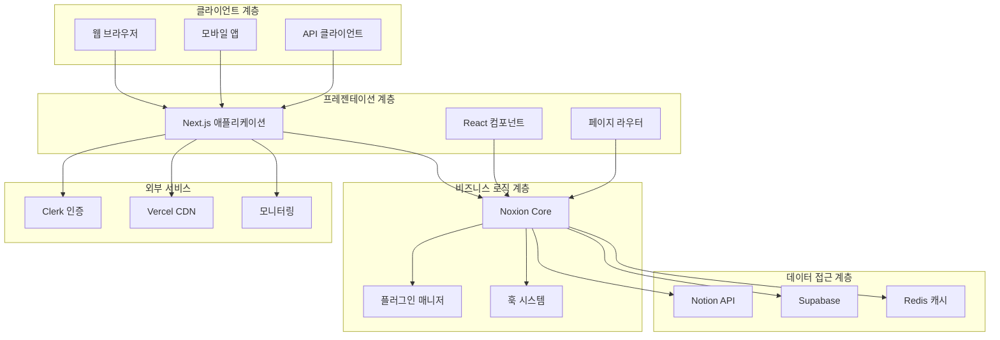
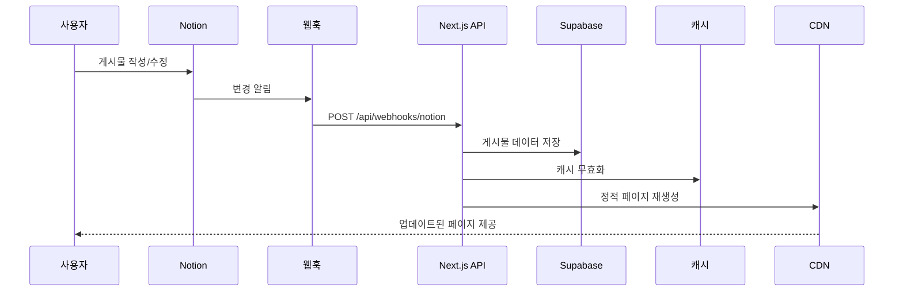
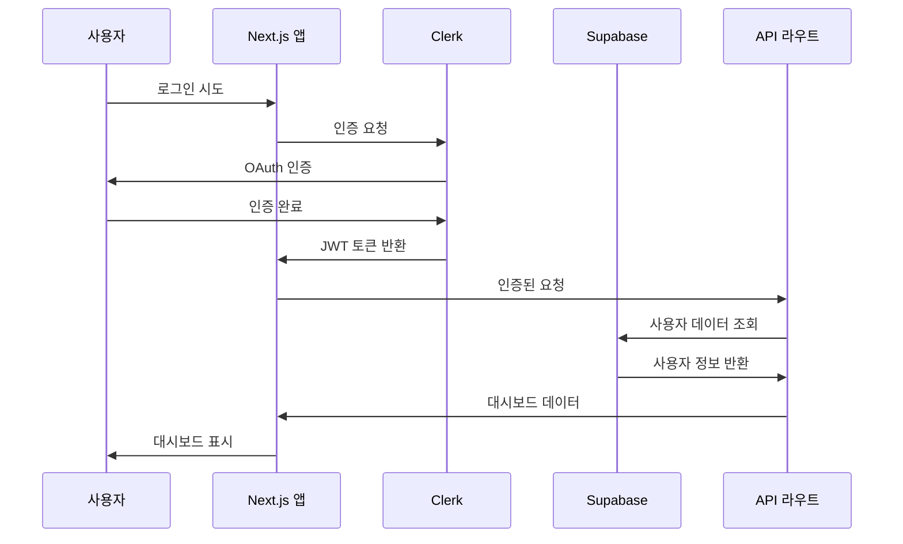
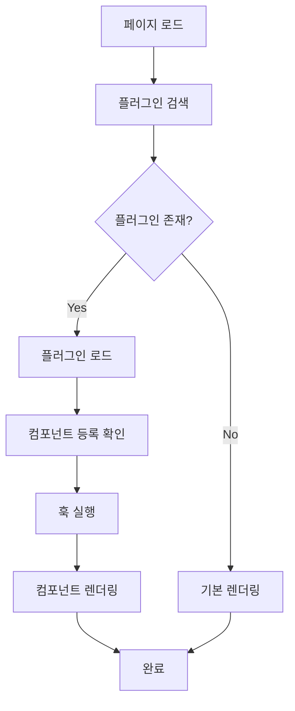

# 시스템 아키텍처 설계서

## 📋 목차
1. [아키텍처 개요](#아키텍처-개요)
2. [고수준 아키텍처](#고수준-아키텍처)
3. [상세 컴포넌트 설계](#상세-컴포넌트-설계)
4. [데이터 플로우](#데이터-플로우)
5. [플러그인 아키텍처](#플러그인-아키텍처)
6. [멀티 테넌트 설계](#멀티-테넌트-설계)
7. [확장성 및 성능](#확장성-및-성능)
8. [보안 아키텍처](#보안-아키텍처)

## 🏗️ 아키텍처 개요

### 설계 원칙

#### 1. 모듈화 (Modularity)
- **관심사 분리**: 각 컴포넌트는 단일 책임 원칙 준수
- **느슨한 결합**: 컴포넌트 간 의존성 최소화
- **높은 응집도**: 관련 기능들을 논리적으로 그룹화

#### 2. 확장성 (Scalability)
- **수평 확장**: 로드 밸런싱과 마이크로서비스 지원
- **플러그인 시스템**: 기능 확장 시 코어 수정 불필요
- **캐싱 전략**: 다층 캐싱으로 성능 최적화

#### 3. 유지보수성 (Maintainability)
- **타입 안전성**: TypeScript 100% 적용
- **테스트 가능성**: 의존성 주입과 모킹 지원
- **문서화**: 코드와 API 자동 문서화

#### 4. 신뢰성 (Reliability)
- **오류 처리**: 우아한 실패와 복구 메커니즘
- **데이터 일관성**: ACID 트랜잭션과 이벤트 소싱
- **가용성**: 99.9% 업타임 목표

## 🎯 고수준 아키텍처



### 아키텍처 레이어

#### 1. 프레젠테이션 계층 (Presentation Layer)
```typescript
// Next.js 앱 라우터 구조
apps/web/app/
├── (auth)/                 # 인증 그룹
│   ├── sign-in/
│   └── sign-up/
├── [username]/             # 사용자 블로그
│   ├── page.tsx           # 블로그 홈
│   └── posts/[slug]/      # 개별 포스트
├── dashboard/              # 사용자 대시보드
│   ├── layout.tsx
│   ├── page.tsx
│   └── blogs/[id]/
└── api/                    # API 라우트
    ├── dashboard/
    └── webhooks/
```

#### 2. 비즈니스 로직 계층 (Business Logic Layer)
```typescript
// 핵심 서비스 아키텍처
packages/core/src/
├── services/
│   ├── NotionService.ts    # Notion API 통합
│   ├── BlogService.ts      # 블로그 비즈니스 로직
│   ├── UserService.ts      # 사용자 관리
│   └── PluginService.ts    # 플러그인 관리
├── managers/
│   ├── PluginManager.ts    # 플러그인 라이프사이클
│   ├── CacheManager.ts     # 캐시 관리
│   └── EventManager.ts     # 이벤트 처리
└── utils/
    ├── validation.ts       # 데이터 검증
    ├── sanitization.ts     # 데이터 정제
    └── error-handling.ts   # 오류 처리
```

#### 3. 데이터 접근 계층 (Data Access Layer)
```typescript
// 데이터 접근 패턴
interface DataAccessLayer {
  repositories: {
    UserRepository: Repository<User>
    BlogRepository: Repository<Blog>
    PostRepository: Repository<Post>
    PluginRepository: Repository<Plugin>
  }
  
  adapters: {
    NotionAdapter: ExternalApiAdapter
    SupabaseAdapter: DatabaseAdapter
    CacheAdapter: CacheAdapter
  }
  
  migrations: {
    SchemaManager: SchemaManager
    DataMigrator: DataMigrator
  }
}
```

## 🔧 상세 컴포넌트 설계

### 핵심 컴포넌트

#### 1. Noxion Core
```typescript
class NoxionCore {
  private pluginManager: PluginManager
  private eventManager: EventManager
  private cacheManager: CacheManager
  
  constructor(config: NoxionConfig) {
    this.pluginManager = new PluginManager(config.plugins)
    this.eventManager = new EventManager()
    this.cacheManager = new CacheManager(config.cache)
  }

  // 플러그인 등록
  async registerPlugin(plugin: NoxionPlugin): Promise<void> {
    await this.pluginManager.register(plugin)
    this.eventManager.emit('plugin:registered', { plugin })
  }

  // 컴포넌트 등록
  registerComponent(name: string, component: React.ComponentType): void {
    this.pluginManager.registerComponent(name, component)
  }

  // 훅 실행
  async executeHook(hookName: string, data: any): Promise<any> {
    return this.pluginManager.executeHook(hookName, data)
  }
}
```

#### 2. 플러그인 매니저
```typescript
class PluginManager {
  private plugins: Map<string, NoxionPlugin> = new Map()
  private components: Map<string, React.ComponentType> = new Map()
  private hooks: Map<string, HookHandler[]> = new Map()
  private routes: Map<string, RouteHandler> = new Map()

  async register(plugin: NoxionPlugin): Promise<void> {
    // 플러그인 검증
    this.validatePlugin(plugin)
    
    // 의존성 확인
    await this.checkDependencies(plugin)
    
    // 플러그인 등록
    this.plugins.set(plugin.name, plugin)
    
    // 컨텍스트 생성 및 등록 실행
    const context = this.createContext(plugin)
    await plugin.register(context)
    
    // 상태 업데이트
    this.updatePluginState(plugin.name, 'active')
  }

  private createContext(plugin: NoxionPlugin): NoxionCoreContext {
    return {
      registerComponent: this.registerComponent.bind(this),
      registerRoute: this.registerRoute.bind(this),
      registerHook: this.registerHook.bind(this),
      executeHook: this.executeHook.bind(this),
      cache: this.cacheManager,
      logger: this.createLogger(plugin.name)
    }
  }
}
```

#### 3. 이벤트 시스템
```typescript
interface EventSystem {
  // 시스템 이벤트
  'app:startup': { timestamp: Date }
  'app:shutdown': { reason: string }
  
  // 플러그인 이벤트
  'plugin:registered': { plugin: NoxionPlugin }
  'plugin:activated': { pluginName: string }
  'plugin:deactivated': { pluginName: string }
  
  // 콘텐츠 이벤트
  'post:created': { post: Post, user: User }
  'post:updated': { post: Post, changes: Partial<Post> }
  'post:published': { post: Post }
  
  // 사용자 이벤트
  'user:registered': { user: User }
  'user:login': { user: User, timestamp: Date }
  'blog:created': { blog: Blog, user: User }
}

class EventManager {
  private listeners: Map<string, EventListener[]> = new Map()

  on<T extends keyof EventSystem>(
    event: T, 
    listener: (data: EventSystem[T]) => void
  ): void {
    if (!this.listeners.has(event)) {
      this.listeners.set(event, [])
    }
    this.listeners.get(event)!.push(listener)
  }

  emit<T extends keyof EventSystem>(
    event: T, 
    data: EventSystem[T]
  ): void {
    const listeners = this.listeners.get(event) || []
    listeners.forEach(listener => {
      try {
        listener(data)
      } catch (error) {
        console.error(`Event listener error for ${event}:`, error)
      }
    })
  }
}
```

## 🔄 데이터 플로우

### 1. 콘텐츠 발행 플로우


### 2. 사용자 인증 플로우


### 3. 플러그인 실행 플로우


## 🔌 플러그인 아키텍처

### 플러그인 생명주기

#### 1. 등록 단계 (Registration)
```typescript
interface PluginRegistration {
  // 1. 플러그인 메타데이터 검증
  validateMetadata(plugin: NoxionPlugin): boolean
  
  // 2. 의존성 확인
  checkDependencies(plugin: NoxionPlugin): Promise<boolean>
  
  // 3. 보안 검증
  validateSecurity(plugin: NoxionPlugin): boolean
  
  // 4. 리소스 할당
  allocateResources(plugin: NoxionPlugin): void
  
  // 5. 컨텍스트 생성
  createContext(plugin: NoxionPlugin): NoxionCoreContext
}
```

#### 2. 활성화 단계 (Activation)
```typescript
async function activatePlugin(pluginName: string): Promise<void> {
  const plugin = this.plugins.get(pluginName)
  if (!plugin) throw new Error(`Plugin ${pluginName} not found`)

  try {
    // 상태 변경
    await this.updatePluginState(pluginName, 'activating')
    
    // 클라이언트 초기화 (브라우저에서만)
    if (typeof window !== 'undefined' && plugin.initializeClient) {
      await plugin.initializeClient()
    }
    
    // 이벤트 발생
    this.eventManager.emit('plugin:activated', { pluginName })
    
    // 상태 완료
    await this.updatePluginState(pluginName, 'active')
    
  } catch (error) {
    await this.updatePluginState(pluginName, 'error')
    throw error
  }
}
```

#### 3. 실행 단계 (Execution)
```typescript
interface PluginExecution {
  // 컴포넌트 렌더링
  renderComponent(name: string, props: any): React.ReactElement
  
  // 훅 실행
  executeHook(hookName: string, data: any): Promise<any>
  
  // API 라우트 처리
  handleApiRoute(request: Request, context: RouteContext): Promise<Response>
  
  // 이벤트 처리
  handleEvent(event: string, data: any): void
}
```

### 플러그인 타입별 아키텍처

#### 1. UI 컴포넌트 플러그인
```typescript
interface UIComponentPlugin extends NoxionPlugin {
  components: {
    [name: string]: React.ComponentType<any>
  }
  
  styles?: {
    css?: string
    theme?: ThemeConfig
  }
  
  dependencies?: {
    react: string
    'react-dom': string
  }
}

// 예시: 댓글 플러그인
const commentsPlugin: UIComponentPlugin = {
  name: 'comments',
  version: '1.0.0',
  components: {
    CommentsSection: CommentsSection,
    CommentForm: CommentForm,
    CommentList: CommentList
  },
  
  register: async (core) => {
    // 컴포넌트 등록
    Object.entries(this.components).forEach(([name, component]) => {
      core.registerComponent(name, component)
    })
    
    // API 라우트 등록
    core.registerRoute('POST /api/comments', handleCreateComment)
    core.registerRoute('GET /api/comments/:postId', handleGetComments)
  }
}
```

#### 2. 데이터 처리 플러그인
```typescript
interface DataProcessingPlugin extends NoxionPlugin {
  processors: {
    [hookName: string]: HookHandler
  }
  
  config?: {
    apiKeys?: string[]
    endpoints?: string[]
  }
}

// 예시: SEO 플러그인
const seoPlugin: DataProcessingPlugin = {
  name: 'seo',
  version: '1.0.0',
  
  processors: {
    'afterPostRender': async (post) => {
      return {
        ...post,
        seo: {
          title: generateSeoTitle(post.title),
          description: generateSeoDescription(post.content),
          keywords: extractKeywords(post.content),
          openGraph: generateOpenGraphTags(post)
        }
      }
    }
  },
  
  register: async (core) => {
    Object.entries(this.processors).forEach(([hookName, handler]) => {
      core.registerHook(hookName, handler)
    })
  }
}
```

#### 3. 서비스 통합 플러그인
```typescript
interface ServiceIntegrationPlugin extends NoxionPlugin {
  services: {
    [name: string]: ExternalService
  }
  
  webhooks?: {
    [path: string]: WebhookHandler
  }
}

// 예시: 분석 플러그인
const analyticsPlugin: ServiceIntegrationPlugin = {
  name: 'analytics',
  version: '1.0.0',
  
  services: {
    tracker: new AnalyticsTracker(),
    reporter: new AnalyticsReporter()
  },
  
  webhooks: {
    '/analytics/track': handleTrackingWebhook
  },
  
  register: async (core) => {
    // 페이지 뷰 추적
    core.registerHook('afterPageRender', async (pageData) => {
      await this.services.tracker.trackPageView(pageData)
    })
    
    // 웹훅 등록
    Object.entries(this.webhooks || {}).forEach(([path, handler]) => {
      core.registerRoute(`POST ${path}`, handler)
    })
  }
}
```

## 🏢 멀티 테넌트 설계

### 테넌트 격리 전략

#### 1. 데이터 격리 (Data Isolation)
```sql
-- 행 수준 보안 (Row Level Security)
CREATE POLICY "Users can only see their own blogs"
ON blogs FOR ALL
USING (user_id = auth.uid());

CREATE POLICY "Users can only see their own posts"
ON posts FOR ALL
USING (
  EXISTS (
    SELECT 1 FROM blogs 
    WHERE blogs.id = posts.blog_id 
    AND blogs.user_id = auth.uid()
  )
);

-- 테넌트별 스키마 (옵션)
CREATE SCHEMA tenant_user123;
CREATE TABLE tenant_user123.posts (
  id UUID PRIMARY KEY,
  title TEXT,
  content TEXT,
  created_at TIMESTAMP DEFAULT NOW()
);
```

#### 2. 애플리케이션 격리 (Application Isolation)
```typescript
class TenantContext {
  constructor(
    public tenantId: string,
    public userId: string,
    public permissions: Permission[]
  ) {}

  // 테넌트별 서비스 인스턴스
  createBlogService(): BlogService {
    return new BlogService(this.tenantId, this.userId)
  }

  createPluginManager(): PluginManager {
    const config = this.getTenantPluginConfig()
    return new PluginManager(config)
  }

  // 권한 확인
  hasPermission(permission: Permission): boolean {
    return this.permissions.includes(permission)
  }
}
```

#### 3. 리소스 격리 (Resource Isolation)
```typescript
interface TenantResourceLimits {
  maxBlogs: number
  maxPostsPerMonth: number
  maxPlugins: number
  maxApiCallsPerHour: number
  maxStorageGB: number
}

class ResourceManager {
  async checkLimits(tenantId: string, resource: string): Promise<boolean> {
    const limits = await this.getTenantLimits(tenantId)
    const usage = await this.getCurrentUsage(tenantId, resource)
    
    return usage < limits[resource]
  }

  async enforceRateLimit(tenantId: string, endpoint: string): Promise<boolean> {
    const key = `rate_limit:${tenantId}:${endpoint}`
    const current = await this.cache.get(key) || 0
    
    if (current >= this.getRateLimit(endpoint)) {
      return false
    }
    
    await this.cache.increment(key, 1, { ttl: 3600 })
    return true
  }
}
```

### 멀티 테넌트 플러그인 관리

#### 1. 테넌트별 플러그인 설정
```typescript
interface TenantPluginConfig {
  tenantId: string
  enabledPlugins: string[]
  pluginConfigs: {
    [pluginName: string]: any
  }
  permissions: {
    [pluginName: string]: Permission[]
  }
}

class MultiTenantPluginManager extends PluginManager {
  private tenantConfigs: Map<string, TenantPluginConfig> = new Map()

  async loadTenantPlugins(tenantId: string): Promise<void> {
    const config = await this.getTenantConfig(tenantId)
    this.tenantConfigs.set(tenantId, config)

    // 테넌트별 허용된 플러그인만 로드
    for (const pluginName of config.enabledPlugins) {
      if (this.isPluginAllowed(tenantId, pluginName)) {
        await this.activatePluginForTenant(tenantId, pluginName)
      }
    }
  }

  private isPluginAllowed(tenantId: string, pluginName: string): boolean {
    const config = this.tenantConfigs.get(tenantId)
    return config?.enabledPlugins.includes(pluginName) || false
  }
}
```

## ⚡ 확장성 및 성능

### 수평 확장 아키텍처

#### 1. 로드 밸런싱
```typescript
interface LoadBalancingStrategy {
  // Round Robin
  roundRobin: {
    servers: string[]
    current: number
  }
  
  // Weighted Round Robin
  weighted: {
    servers: { url: string, weight: number }[]
  }
  
  // Least Connections
  leastConnections: {
    servers: { url: string, connections: number }[]
  }
}

class LoadBalancer {
  async routeRequest(request: Request): Promise<string> {
    const strategy = this.getStrategy()
    
    switch (strategy.type) {
      case 'round_robin':
        return this.roundRobin(strategy.config)
      case 'weighted':
        return this.weightedRoundRobin(strategy.config)
      case 'least_connections':
        return this.leastConnections(strategy.config)
      default:
        throw new Error('Unknown load balancing strategy')
    }
  }
}
```

#### 2. 캐싱 전략
```typescript
interface CachingStrategy {
  // L1: 메모리 캐시 (Node.js 프로세스)
  memory: {
    maxSize: number
    ttl: number
  }
  
  // L2: Redis 캐시 (공유)
  redis: {
    cluster: string[]
    ttl: number
  }
  
  // L3: CDN 캐시 (Vercel Edge)
  cdn: {
    regions: string[]
    ttl: number
    purgeOnUpdate: boolean
  }
}

class MultiLevelCache {
  async get(key: string): Promise<any> {
    // L1: 메모리 캐시 확인
    let value = this.memoryCache.get(key)
    if (value) return value

    // L2: Redis 캐시 확인
    value = await this.redisCache.get(key)
    if (value) {
      this.memoryCache.set(key, value)
      return value
    }

    // L3: 원본 데이터 조회
    value = await this.dataSource.get(key)
    if (value) {
      await this.redisCache.set(key, value)
      this.memoryCache.set(key, value)
    }

    return value
  }
}
```

### 성능 최적화

#### 1. 번들 분할 및 지연 로딩
```typescript
// 동적 임포트를 통한 코드 분할
const DynamicPluginComponent = dynamic(
  () => import(`../plugins/${pluginName}/Component`),
  {
    loading: () => <PluginSkeleton />,
    ssr: false
  }
)

// 플러그인별 번들 분할
const pluginImports = {
  comments: () => import('@noxion/plugin-comments'),
  analytics: () => import('@noxion/plugin-analytics'),
  seo: () => import('@noxion/plugin-seo')
}

class LazyPluginLoader {
  private loadedPlugins: Set<string> = new Set()

  async loadPlugin(pluginName: string): Promise<NoxionPlugin> {
    if (this.loadedPlugins.has(pluginName)) {
      return this.getLoadedPlugin(pluginName)
    }

    const importFn = pluginImports[pluginName]
    if (!importFn) {
      throw new Error(`Unknown plugin: ${pluginName}`)
    }

    const pluginModule = await importFn()
    const plugin = pluginModule.default || pluginModule

    this.loadedPlugins.add(pluginName)
    return plugin
  }
}
```

#### 2. 데이터베이스 최적화
```sql
-- 인덱스 최적화
CREATE INDEX CONCURRENTLY idx_posts_blog_id_published 
ON posts (blog_id, published_at DESC) 
WHERE published = true;

CREATE INDEX CONCURRENTLY idx_posts_search 
ON posts USING gin(to_tsvector('english', title || ' ' || content))
WHERE published = true;

-- 파티셔닝 (대용량 데이터)
CREATE TABLE posts_2024 PARTITION OF posts
FOR VALUES FROM ('2024-01-01') TO ('2025-01-01');
```

## 🔒 보안 아키텍처

### 심층 방어 (Defense in Depth)

#### 1. 네트워크 보안
```typescript
interface NetworkSecurity {
  // HTTPS 강제
  httpsRedirect: boolean
  
  // Security Headers
  headers: {
    'Strict-Transport-Security': string
    'Content-Security-Policy': string
    'X-Frame-Options': string
    'X-Content-Type-Options': string
    'Referrer-Policy': string
  }
  
  // Rate Limiting
  rateLimiting: {
    window: number // ms
    maxRequests: number
    skipSuccessfulRequests: boolean
  }
}
```

#### 2. 애플리케이션 보안
```typescript
class SecurityManager {
  // 입력 검증 및 정제
  validateInput(input: any, schema: ValidationSchema): boolean {
    return this.validator.validate(input, schema)
  }

  sanitizeHtml(html: string): string {
    return this.htmlSanitizer.sanitize(html, {
      allowedTags: ['p', 'strong', 'em', 'ul', 'ol', 'li'],
      allowedAttributes: {}
    })
  }

  // SQL Injection 방지
  async safeQuery(query: string, params: any[]): Promise<any> {
    const prepared = this.db.prepare(query)
    return prepared.all(params)
  }

  // XSS 방지
  escapeHtml(text: string): string {
    return text
      .replace(/&/g, '&amp;')
      .replace(/</g, '&lt;')
      .replace(/>/g, '&gt;')
      .replace(/"/g, '&quot;')
      .replace(/'/g, '&#x27;')
  }
}
```

#### 3. 데이터 보안
```typescript
interface DataSecurity {
  // 암호화
  encryption: {
    algorithm: 'AES-256-GCM'
    keyRotation: number // days
  }
  
  // 접근 제어
  accessControl: {
    model: 'RBAC' // Role-Based Access Control
    roles: Role[]
    permissions: Permission[]
  }
  
  // 감사 로깅
  auditLogging: {
    events: string[]
    retention: number // days
    encryption: boolean
  }
}

class DataProtection {
  async encrypt(data: string, key: string): Promise<string> {
    const cipher = crypto.createCipher('aes-256-gcm', key)
    let encrypted = cipher.update(data, 'utf8', 'hex')
    encrypted += cipher.final('hex')
    return encrypted
  }

  async auditLog(event: AuditEvent): Promise<void> {
    const logEntry = {
      timestamp: new Date().toISOString(),
      userId: event.userId,
      action: event.action,
      resource: event.resource,
      result: event.result,
      ipAddress: event.ipAddress,
      userAgent: event.userAgent
    }

    await this.auditLogger.log(logEntry)
  }
}
```

---

*이 시스템 아키텍처 설계서는 Noxion 프로젝트의 기술적 구조와 설계 결정을 상세히 문서화합니다. 시스템 발전에 따라 지속적으로 업데이트됩니다.*